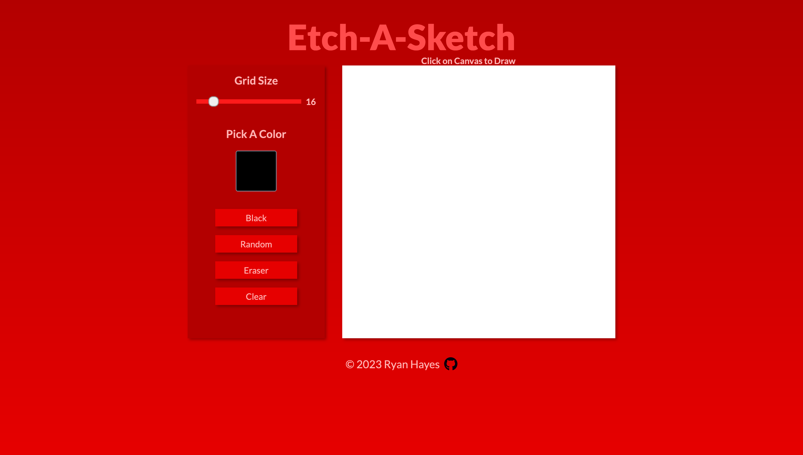

# The Odin Project - Etch A Sketch

## Table of contents

- [Overview](#overview)
  - [The goal](#the-goal)
  - [Preview](#preview)
- [My process](#my-process)
  - [Built with](#built-with)
  - [Features](#features)
  - [Outcome](#outcome)
  - [What I learned](#what-i-learned)
  - [Continued development](#continued-development)
  - [Proud of](#proud-of)
  - [Useful resources](#useful-resources)
- [Author](#author)

### The goal 

The goal of the project was to o build a browser version of something between a sketchpad and an Etch-A-Sketch. 

### Preview

## My process

### Built With

   
   

### Features

-   
- It can evaluate expressions for Multiplication, Division, Subtraction & Addition 

### Outcome

* Used HTML5 **semantic elements** for better readability and structure
* Used CSS3 **flex** to manage layout
* Used **Data-Attributes** for accessing DOM Elements
* Used **Git** and **GitHub** for project management
* Tried to maintain **clean code**
* **Cross tested** on Firefox and Chromium based browsers

### What I learned

- Create x number of elements using for Loop.
- Create and style a **HTML Range Slider**.
- Create a **HTML Color Picker**.
- Include CSS variables in JavaScript.

### Proud of

### Useful resources

- [Javascript Get HTML Slider Value](https://www.thepoorcoder.com/javascript-get-html-slider-value/)
- [How TO - Range Sliders](https://www.w3schools.com/howto/howto_js_rangeslider.asp)
- [Remove inside border in type=color](https://stackoverflow.com/questions/65910526/remove-inside-border-in-type-color)
- [How TO - Color Picker](https://www.w3schools.com/howto/howto_html_colorpicker.asp)

## Author

